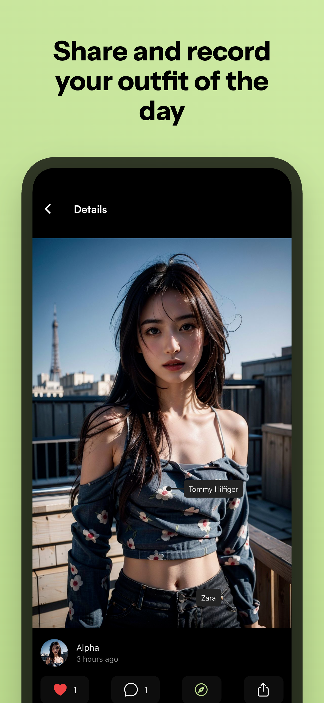
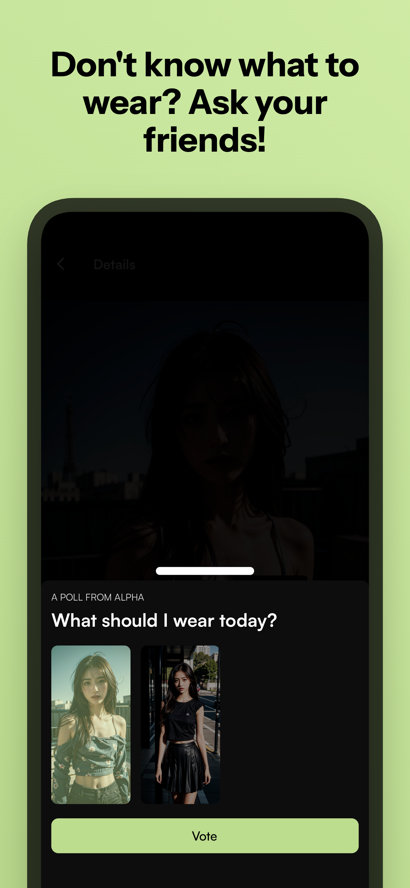
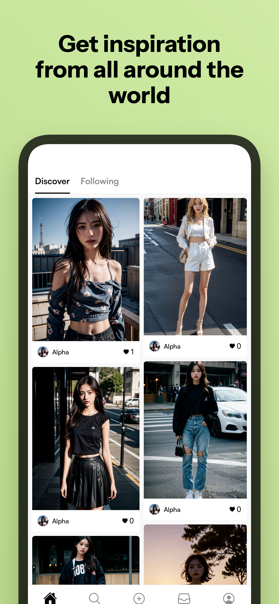
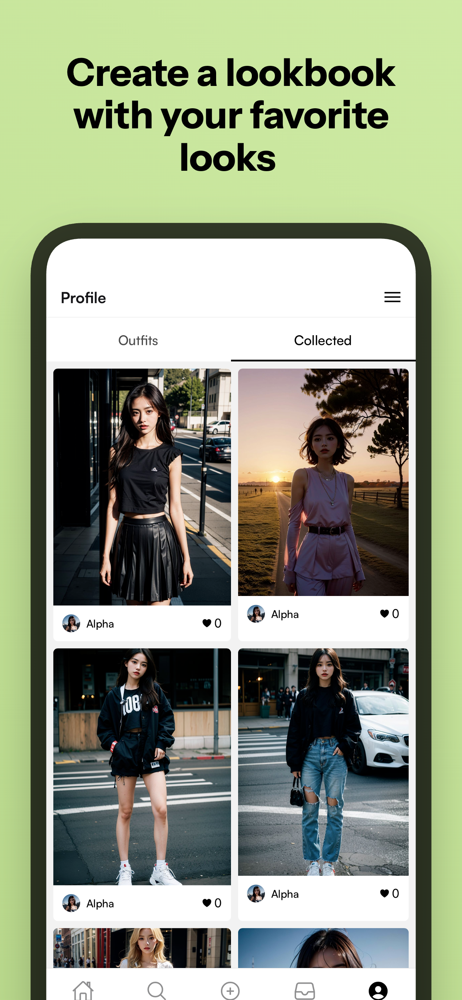

# 📸 Vouture

✨ _Save your outfits of the day and get inspiration for your next look._

<table align="center">
   <tr>
        <td align="center"></td>
        <td align="center">
   </tr>
   <tr>
        <td align="center"></td>
        <td align="center"></td>
   </tr>
</table>

## ℹ️ What is this?

This repository contains the front-end code of Vouture (previously published as _WTWT: What to Wear Today_) — a project during the summer of 2022. The application is written in React Native with Expo and is a social platform for sharing and discovering outfit inspiration.

## 🛠️ Core Features

- Tag where your clothing items are from
- Polls to help select between many outfits
- Search to discover new outfits
- User profiles and customization
- Infinite scrolling feeds
- Real-time notifications
- Media upload and image carousels
- Privacy and settings management
- User verification via email code authentication
